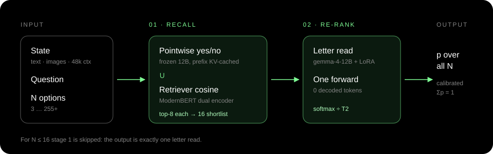

<p align="center">
  <picture>
    <source media="(prefers-color-scheme: dark)" srcset="assets/logo-white.svg">
    
  </picture>
</p>

<h1 align="center">TOD · UTOD picker v1</h1>

<p align="center">
  <b>A general-purpose decision model with vision.</b><br>
  State + question + N options in → a calibrated probability for every option out.
</p>

<p align="center">
  
  
  
  
  
</p>

<p align="center">
  <a href="https://daseinlabs.ai/tod">daseinlabs.ai/tod</a> ·
  <a href="#03-quickstart">Quickstart</a> ·
  <a href="#04-results">Results</a> ·
  <a href="#05-serving">Serving</a>
</p>

---

| | |
|---|---|
| **Any N** | 3 to 255+ options, exact and order-invariant, measured up to N = 300 |
| **Sees** | images go through Gemma-4's native vision tower; +.17 to +.25 accuracy over the same model text-only |
| **Calibrated** | raw ECE-db .008 on JevBench; temperatures fit only on our own held-out validation |
| **No decoding** | the answer is read from the logits; cost is input tokens only |

## `01` What it is

| part | what |
|---|---|
| base | [`google/gemma-4-12B-it`](https://huggingface.co/google/gemma-4-12B-it), frozen, pulled from HF (not redistributed) |
| stage-2 adapter | LoRA r16 / α32 on text-model q/k/v/o (82 MB). Trained with letter cross-entropy on 30,360 licence-clean decision rows (2 epochs, lr 3e-5) |
| stage-1 retriever | ModernBERT-base dual encoder (572 MB). Trained with InfoNCE plus ANCE hard negatives |
| temperatures | T1 1.7237, T2 1.4778, T1_ret 0.05. Brier-optimal, fit on 602 held-out VAL rows (never on JevBench) |

## `02` How it decides

<p align="center"></p>

1. **Stage 1 (recall, any N).** Two scores per option: the frozen 12B's pointwise yes/no log-odds
   (prefix KV-cached, one branch per option) and the retriever's cosine score. The top 8 from each
   are unioned into a 16-wide shortlist, kept in original order.
2. **Stage 2 (re-rank).** One forward over `state + question + "A. label: description" …`. A softmax
   restricted to the option letters is taken at the last position and divided by T2.
3. **Final probabilities.** The shortlist's probability mass is multiplied by the stage-2 softmax.
   Options outside the shortlist share the stage-1 tail mass. **For N ≤ 16 this is exactly a plain
   letter read.**

Images go through Gemma-4's native vision tower (AutoProcessor).

## `03` Quickstart

```bash
pip install -e .                       # or: pip install -r requirements.txt
hf auth login                          # accept the Gemma-4 licence on HF first
scripts/fetch_weights.sh               # adapter + retriever + picker.json -> ./picker (sha256-verified)

python inference.py --example examples/choice.json
python inference.py --state "It is raining hard." --options umbrella sunglasses sandals
python inference.py --state "What trend does the chart show?" --options rising falling flat --image chart.png
```

```python
from tod.release.load import load_picker

picker = load_picker("picker")                      # device="cuda", bf16, chunked_eager attention
probs = picker.predict(
    state="A customer was charged twice and wants one payment returned.",
    options=["refund_request", "order_status", "cancel_order"],   # or {label: description}
    question="Which intent matches?",                              # optional
    images=None,                                                   # optional list of paths
)
# -> [p_refund, p_status, p_cancel], sums to 1
```

Tests (CPU, no weights needed): `pip install -e '.[test]' && pytest tests -p no:randomly -q`

## `04` Results

All numbers are on held-out data. JevBench was never used for training or calibration.

**What training changed (frozen Gemma → ours):**

| | frozen | **ours** |
|---|---|---|
| ScienceQA / AI2D / ChartQA (with image, n=100 each) | .83 / .80 / .70 | **.90 / .87 / .97** |
| High-N sets (N 50–174), Brier / ECE-db | .469 / .231 | **.374 / .050** |
| JevBench raw (pre-T) Brier / ECE-db | .248 / .078 | **.192 / .008** |
| In-distribution accuracy (proxy val, 1,560 rows) | .726 | **.77** |

Images help: compared with running the same model text-only, accuracy goes up by +.17 / +.25 /
+.18 on ScienceQA / AI2D / ChartQA, and every 95% CI excludes zero.

**High-N accuracy** (200 rows per set): banking77 (N=50) .76 · clinc150 (N=50) .93 ·
lexglue (N=100) .725 · tasksource (N=174) .53 · synthetic N=300 .55 (chance .003).

**JevBench public (231 items, bf16):**

| | acc | easy / orig / hard | Brier | ECE-db |
|---|---|---|---|---|
| frozen base, same readout | 0.8615 | 1.000 / .944 / .748 | .196 | .036 |
| **this model** | 0.8442 | 1.000 / .917 / .730 | .194 | .033 |

**The cost.** Training on our corpus lost 4 public JevBench items, all in general-reasoning
families (multi_hop −2; ordinal, adequacy, temporal −1 each). This model is **not** state of the
art on JevBench public accuracy: Cygnet, the frozen same-base model, scores 0.879. What it adds is
the full Jev contract (any N, images, 48k context) with calibration fit only on our own validation
data, never on the benchmark.

## `05` Serving

> [!IMPORTANT]
> Read this before you deploy.

- **Never use `sdpa` attention on gemma-4-12B.** It gives wrong logits (5–12 log-odds off, even
  unpadded, in any dtype). Use `chunked_eager` (the default; `tod/model/attn_chunked.py`) or
  `eager`. flash-attn doesn't work here (head_dim 256). If memory runs out on very long states,
  lower `CHUNKED_ATTN_Q`.
- **Keep `max_tokens` at 49,152.**
- **Precision.** bf16 is the serving reference; bf16 drift is ≤ ~2 log-odds on rare rows and the
  argmax is unchanged. The stage-1 *pointwise* branches fail the exactness check in bf16, so run
  them in fp32 or use the retriever-only stage 1. **Don't use bnb int8**: 8% of picks flip and it's
  no faster. For FP8 or INT4-AWQ, refit T1/T2 for each quantized artefact.
- **Latency** (A100-40G, bf16, batch 1, warm): N ≤ 16 has p50 542 ms; N 50–174 (retriever stage 1)
  has p50 182 ms. Nothing is generated, so cost is input tokens only.
- **vLLM.** Send `max_tokens=1` with `allowed_token_ids` set to the option letters (both `A` and
  ` A` variants) and logprobs on, then logsumexp the two variants of each letter.

## `06` Licence and use

- The adapter and retriever are released under the LICENSE in the bundle; see NOTICE.
- The base model is governed by the Gemma 4 terms, and the Gemma Prohibited Use Policy applies.
- Training data is the 2026-09-24 licence-policy mix. JevBench was excluded from both training and
  calibration.

## `07` Layout

```
inference.py          CLI over tod.release.load
tod/release/load.py   load_picker() / Picker.predict()
tod/eval/             letter_logit (two-stage scorer, prompts, probability math), metrics
tod/model/            attn_chunked (exact attention for gemma-4)
tod/train/            pointwise_sft / retriever_sft helpers used at inference
tests/                CPU unit tests (two-stage math, chunked attention, scorer fixes)
assets/               logo + pipeline diagram
```

The code is copied from `daseinlabs/tod_training@30adf66` (it includes image-path fix 445df3f).

---

<p align="center"><sub>Built by <a href="https://daseinlabs.ai">Dasein Labs</a></sub></p>
